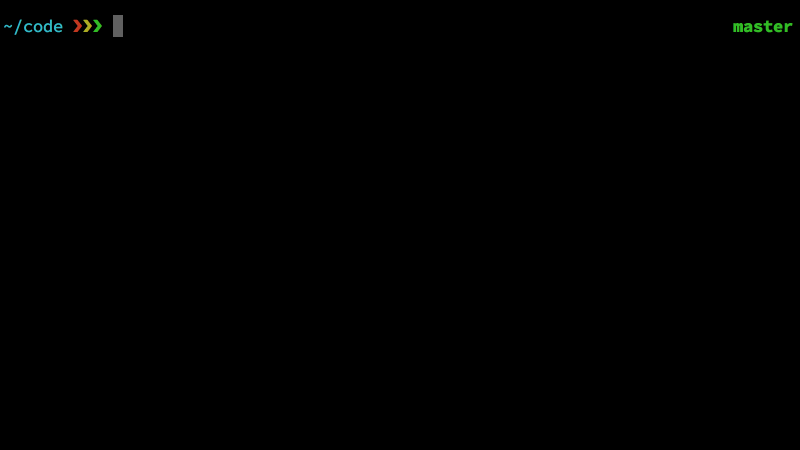

<h1 align="center">
  <a href="https://feross.org/thanks"></a>
  <br>
</h1>

<h4 align="center">🙌 Give thanks to the open source maintainers you depend on! ✨</h4>

<p align="center">
  <a href="https://travis-ci.org/feross/thanks"></a>
  <a href="https://www.npmjs.com/package/thanks"></a>
  <a href="https://www.npmjs.com/package/thanks"></a>
  <a href="https://standardjs.com"></a>
</p>
<br>



> "Put your money where your love is."
> – The Grateful Dead

Open source maintainers do the work that makes our awesome apps, websites, and projects possible! Many authors devote countless hours to open source. Let's help out authors and make the software we rely on healthier at the same time!

[Vote for us on Product Hunt](https://www.producthunt.com/posts/thanks) ❤️

## Usage

It's easy!

1. Run `npx thanks` in your project
2. See which of your dependencies are seeking donations! 💸

## Install

Run it instantly (without installing!) using:

```js
npx thanks
```

Or, install it, then run it:

```js
npm install -g thanks
thanks
```

## 🌟 Open source authors, add yourself to the list

If you're an open source author who accepts donations, add yourself to the `thanks` CLI by [modifying this file](https://github.com/feross/thanks/blob/master/index.js), and sending a pull request!

We're also considering [supporting a new `package.json` field](https://github.com/feross/thanks/issues/2). Please share your thoughts!

## License

MIT. Copyright (c) [Feross Aboukhadijeh](https://feross.org).
